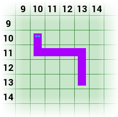

**Start:** XXX

**Termin nadsyłania rozwiązań:** XXX

**Czas, który będzie Ci potrzebny na rozwiązanie całego zadania**: XXX

Po tygodniach ciężkiej, aczkolwiek mamy nadzieje ciekawej
i inspirującej, pracy, czas na trochę rozrywki!  Wybór nie jest może
największy, ale co powiesz na [partyjkę
Węża](http://mina86.github.io/dresscode-snake/demo/snake.html)?

Pewnie już się domyślasz co jest kolejnym zadaniem.  Tym razem, Twoim
celem będzie napisanie gry Wąż.  W tym celu będziesz musiała
zastosować metodologię [programowania
zdarzeniowego](https://pl.wikipedia.org/wiki/Programowanie_sterowane_zdarzeniami),
która pozwala na pisanie kodu reagującego na zdarzenia, takie jak
naciśnięcie klawisza przez użytkownika, na które program nie ma
bezpośredniego wpływu.

## Wąż

TODO: Krótki opis gry w węża.

## Zadanie

Aby ułatwić zadanie, przegotowaliśmy szkielet rozwiązania w postaci
trzech plików.  Pobierz na swój komputer następujące pliki:

 *  [`snake.html`](http://mina86.github.io/dresscode-snake/files/snake.html),
 *  [`snake-framework.js`](http://mina86.github.io/dresscode-snake/files/snake-framework.js) oraz
 *  [`snake.js`](http://mina86.github.io/dresscode-snake/files/snake.js).

### `snake.js`

Twoim zadaniem będzie uzupełnienie pliku `snake.js`.  Zawiera on
definicje czterech pustych funkcji, które mają na celu obsługę logiki
gry.

 *  Funkcja `game.prepareBoard` jest wywołana na początku gry.  Jej
    celem jest przygotowanie, czy też wyzerowanie stanu gry.  W skład
    tej operacji ustawienie węża, jabłek oraz kamieni na planszy
    wliczając to narysowanie tych elementów korzystając z funkcji
    `game.draw*’ opisanych niżej.

 *  Funkcje `game.turnLeft` oraz `game.turnRight` są wołane, gdy gracz
    odpowiednio wciśnie przycisk skrętu w lewo lub w prawo.  Istotne
    jest, że samo wciśnięcie klawisza nie powoduje jeszcze ruchu węża.
    Funkcja powinna jedynie zapisać intencję gracza i uaktualnić
    grafikę tak, aby głowa węża wskazywała w odpowiednią stronę.

    Dopiero funkcja `game.nextMove` powinna poruszyć węża.

    Uwaga: należy poprawnie obsłużyć niemożliwe kombinacje takie jak
    próba dwukrotnego skrętu w lewo, które zazwyczaj powodowałyby
    obrót węża o 180 stopni i tym samym kolizje z jego własnym ciałem.

 *  Funkcja `game.nextMove` jest wołana, gdy następuje ruch węża.  Jej
    celem jest sprawdzenie, czy w efekcie wąż uderza w kamień lub
    swoje własne ciało (co kończy grę), czy może zjada jabłko (co go
    wydłuża i w efekcie zwiększa liczbę punktów).

    Wszystkim zmianom na planszy powinny, oczywiście, towarzyszyć
    wywołania funkcji `game.draw*`, które uaktualniają wygląd planszy.

### `snake-framework.js`

Pliku `snnake-framework.js` nie musisz edytować, choć możesz
oczywiście do niego zajrzeć, aby zobaczyć jak zaimplementowanie są
poszczególne funkcje.  Zawiera on funkcje i zmienne pomocne przy
implementacji gry Wąż.

TODO: Opis współrzędnych oraz faktu, że framework korzysta z obiektów
      z dwoma polami–x oraz y–do reprezentacji współrzędnej.

 *  Zmienne `WIDTH` i `HEIGHT` określają odpowiednie szerokość
    i wysokość planszy do gry.  Należy pamiętać, że układ
    współrzędnych zaczyna się od punktu `(0, 0)` co oznacza, że
    możliwe współrzędne X są od zera do `WIDTH - 1` (włącznie), a Y—od
    zera do `HEIGHT - 1`.

 *  Funkcja `random` zwraca losową liczbę całkowita z podanego
    zakresu.  Przykładowo, `random(0, 1)’ zwróci zero lub jeden,
    a wywołanie `random(1, 6)` symuluje rzut kostką.

 *  Funkcja `randomPoint` zwraca losową współrzędna z planszy do gry.

    Przy wykorzystaniu tej funkcji do wyboru miejsca dla nowego jabłka
    lub kamienia, należy pamiętać, że losowa pozycja może być już
    zajęta przez jakiś obiekt na planszy.  Czy to smaczne jabłko,
    złowieszczy kamień, czy w końcu samego węża.

    Przykładowo, wywołanie `randomPoint()` może zwrócić `{x: 11,
    y:23}`.

 *  Funkcja `game.setScore` przyjmuje jeden argument, który staje się
    nowym wynikiem gracza.  Uaktualnia ona liczbę punktów wyświetlaną
    na stronie.

    Przykładowe wywołanie to `game.setScore(10)`, które ustawia liczbę
    punktów na 10.

 *  Funkcja `game.stopGame` kończy grę i wyświetla aktualny wynik.
    Powinna zostać wywołana wewnątrz `game.nextMove` jeżeli wąż
    „zderzy” się z kamieniem lub samym sobą.

    Funkcja nie przyjmuje argumentów, ani nie zwraca żadnej wartości,
    więc jej wywołanie to zwykłe `game.stopGame()`.

 *  Funkcje `game.drawApple`, `game.drawStone` i `game.drawGrass`
    rysują odpowiednio jabłko, kamień lub trawę na podanej
    współrzędnej.

    Ta ostatnia może służyć do „wyczyszczenia” pola, które było zajęte
    przez węża, jabłko lub kamień, ale obecnie jest puste.

    Funkcje te są potrzebne przy przygotowywaniu planszy poprzez
    `game.prepareBoard` oraz przy uaktualnianiu planszy wewnątrz
    `game.nextMove`.

    Przykładowo, sekwencja:

        game.drawApple({ x: 0, y: 0 });
        game.drawApple({ x: 10, y: 10 });
        game.drawStone({ x: 0, y: HEIGHT - 1});
        game.drawStone({ x: WIDTH - 1, y: HEIGHT - 1});

    Narysuje jabłko w lewym górnym rogu oraz na pozycji punkcie
    `(10, 10)`, a także kamień w lewym dolnym i prawym dolnym rogu.

 *  Funkcje `game.drawSnakeHead`, `game.drawSnakeBody` oraz
    `game.drawSnakeTail` rysują poszczególne części węża–głowę,
    fragment ciała oraz ogon.

    Przyjmują one dwa argumenty.  Pierwszy określa pozycję danego
    fragmentu węża, a drugi jego kształt.  Ponieważ wąż wije się
    w różnych kierunkach, jego ciało może przyjmować kształt różnych
    wygibasów.

    Kształt ten jest określany poprzez jedną z poniższych wartości:

     *  `Direction.LEFT_FROM_RIGHT` lub `Direction.LEFT`—wąż porusza
        się z prawej na lewą stronę: ←
     *  `Direction.RIGHT_FROM_LEFT` lub `Direction.RIGHT`—wąż porusza
        się z lewej na prawą stronę: →
     *  `Direction.UP_FROM_DOWN` lub `Direction.UP`—wąż porusza się
        z dołu na górę: ↑
     *  `Direction.DOWN_FROM_UP` lub `Direction.DOWN`—wąż porusza się
        z góry na dół: ↓
     *  `Direction.LEFT_FROM_DOWN`—wąż porusza się z dołu w lewo: ↰
     *  `Direction.LEFT_FROM_UP`— porusza się z góry w lewo: ↲
     *  `Direction.RIGHT_FROM_DOWN`— porusza się z dołu w prawo: ↱
     *  `Direction.RIGHT_FROM_UP`— porusza się z góry w prawo: ↳
     *  `Direction.UP_FROM_LEFT`— porusza się z lewej w górę: ⬏
     *  `Direction.DOWN_FROM_LEFT`— porusza się z lewej w dół: ⬎
     *  `Direction.UP_FROM_RIGHT`— porusza się z lewej w górę: ⬑
     *  `Direction.DOWN_FROM_RIGHT`— porusza się z lewej w dół: ⬐

    Przykładowo, sekwencja:

        game.drawSnakeHead({ x: 10, y: 10 }, Direction.UP_FROM_DOWN);
        game.drawSnakeBody({ x: 10, y: 11 }, Direction.UP_FROM_RIGHT);
        game.drawSnakeBody({ x: 11, y: 11 }, Direction.LEFT_FROM_RIGHT);
        game.drawSnakeBody({ x: 12, y: 11 }, Direction.LEFT_FROM_RIGHT);
        game.drawSnakeBody({ x: 13, y: 11 }, Direction.LEFT_FROM_DOWN);
        game.drawSnakeBody({ x: 13, y: 12 }, Direction.UP_FROM_DOWN);
        game.drawSnakeTail({ x: 13, y: 13 }, Direction.UP_FROM_DOWN);

    Narysuje węża w kształcie pokazanym na poniższym obrazku:

    

### `snake.html`

Plik `snake.html` to prosty dokument HTML, który definiuje przestrzeń,
na której rysowana będzie plansza do gry i ruchy węża, a także
element, w którym wyświetlany będzie aktualny wynik gry.
